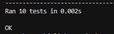

# Etapa 1 Factoriales
## Descripción del problema
El problema que intenta solucionar este código es calcular el factorial de un número entero, no negativo, utilizando dos tecnicas: recursivo e iterativo.

## Instrucciones de ejecución
- Para ejecutar en la terminal: python factorial.py
- Para ejecutar los test python -m unittest test_factorial.py

## Ejemplos de uso
Ejemplos de uso con su salida 
Factorial recursivo de 5: 120
Factorial recursivo de 0: 1
Error: El factorial no funciona con numeros negativos
Factorial iterativo de 5: 120
Factorial iterativo de 0: 1

## Capturas de pantalla de los tests ejecutados
