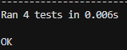

# Etapa 2 Fibonacci
## Descripción del problema
El problema que intenta solucionar este código es calcular el numero fibonacci de un número entero, no negativo, utilizando dos tecnicas: recursivo e iterativo.

## Instrucciones de ejecución
- Para ejecutar en la terminal: python fibonacci.py
- Para ejecutar los test python -m unittest test_fibonacci.py

## Ejemplos de uso
Ejemplos de uso con su salida 
Fibonacci recursivo de 0: 0
Fibonacci recursivo de 1: 1
Fibonacci recursivo de 5: 5
Fibonacci recursivo de 10: 55
Fibonacci iterativo de 0: 0
Fibonacci iterativo de 1: 1
Fibonacci iterativo de 5: 5
Fibonacci iterativo de 10: 55

## Capturas de pantalla de los tests ejecutados
