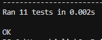

# Etapa 3 flatten
## Descripción del problema
El problema que intenta solucionar esta función flatten es aplanar estructuras de datos anidadas en una única lista plana. Esto significa que toma una lista que puede contener elementos anidados y devuelve una lista donde todos los elementos están en un solo nivel.

## Instrucciones de ejecución
- Para ejecutar en la terminal: python flatten.py
- Para ejecutar los test python -m unittest test_flatten.py

## Ejemplos de uso con su salida
- Lista simple [1, 2, 3, 4]: [1, 2, 3, 4]
- Lista anidada [1, [2, 3], [4, [5, 6]]]: [1, 2, 3, 4, 5, 6]
- Lista con estructuras mixtas [1, (2, 3), {'a': 4, 'b': 5}, [6, [7, 8]]]: [1, 2, 3, 'a', 4, 'b', 5, 6, 7, 8]
- Lista vacía []: []
- Lista con niveles profundos [1, [2, [3, [4, [5, [6]]]]]]: [1, 2, 3, 4, 5, 6]
- Lista con elementos no iterables [1, [2, 3], 4, None]: [1, 2, 3, 4, None]
- Lista con diccionarios [{"a": 1, "b": 2}, [3, {"c": 4}], 5]: ['a', 1, 'b', 2, 3, 'c', 4, 5]

## Capturas de pantalla de los tests ejecutados
